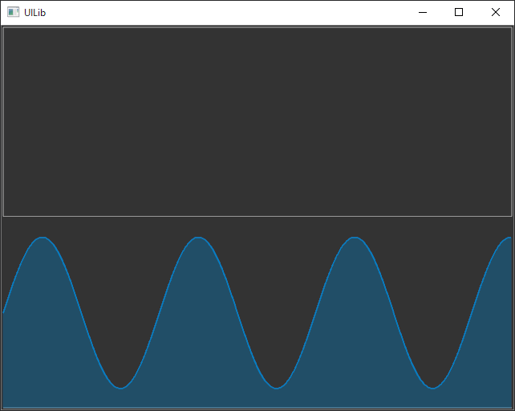

# UILib
大学1年のときに作成した、OpenGLを用いたGUI開発環境の雛形です。
また、開発環境の再現ができなくなったため、大学4年のときにCMakeで環境構築するように変更しました。
(C++の部分は変更していません)

# ビルド方法&実行方法
gitとcmakeが必要になります。  

```
$ git clone https://github.com/wakewakame/UILib
$ cd UILib
$ git submodule update --init --recursive
$ mkdir build && cd build
$ cmake ..
$ make
$ ./UILib
```